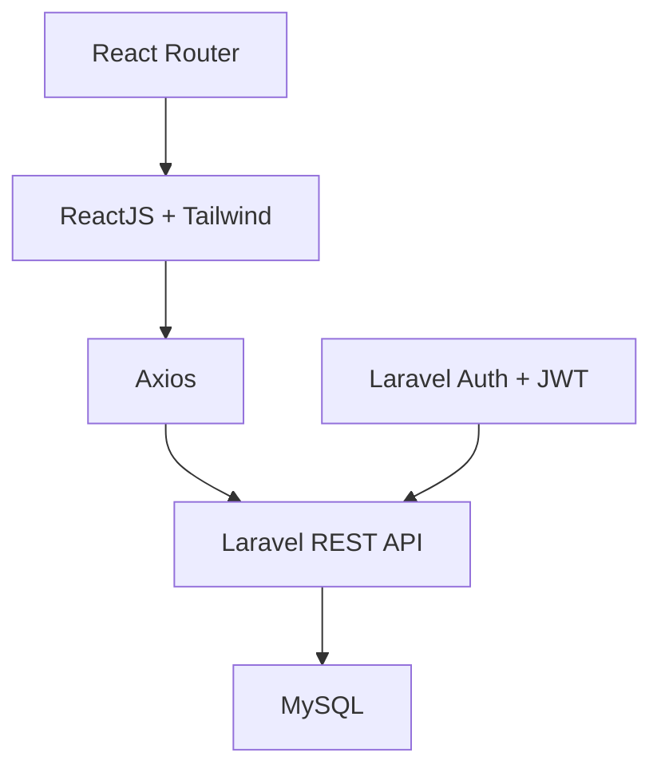

<div align="center">

# 🍎 Apple Store Clone

### ✨ Modern E-Commerce Platform (Inspired by Apple)

<p>
Website thương mại điện tử mô phỏng Apple Store với UI hiện đại, tối giản và trải nghiệm cao cấp
</p>


</div>

---

## 📌 Overview

**Apple Store Clone** là dự án web e-commerce được xây dựng theo phong cách thiết kế của Apple, tập trung vào:

🔹 UI/UX tối giản – tinh tế
🔹 Trải nghiệm người dùng mượt mà
🔹 Kiến trúc tách biệt Frontend & Backend (REST API)

Phù hợp để showcase portfolio hoặc phát triển thành hệ thống bán hàng thực tế.

---

## ✨ Features

### 👤 Customer

| Tính năng          | Mô tả                          |
| ------------------ | ------------------------------ |
| 🔐 Authentication  | Đăng ký / đăng nhập (JWT)      |
| 🛍 Product Catalog | Xem danh sách sản phẩm         |
| 🔍 Search & Filter | Tìm kiếm và lọc sản phẩm       |
| 🛒 Shopping Cart   | Thêm / xoá / cập nhật giỏ hàng |
| 💳 Checkout        | Thanh toán đơn hàng            |
| 📦 Order History   | Xem lịch sử mua hàng           |
| 👤 Profile         | Quản lý thông tin cá nhân      |

---

### 🛠 Admin

| Tính năng             | Mô tả              |
| --------------------- | ------------------ |
| 📱 Product Management | CRUD sản phẩm      |
| 📊 Dashboard          | Thống kê đơn hàng  |
| 📦 Order Management   | Quản lý đơn hàng   |
| 👥 User Management    | Quản lý người dùng |
| 💰 Revenue Analytics  | Báo cáo doanh thu  |

---

## 🧱 Tech Stack

### 🔹 Architecture



---

### 🔹 Frontend

```text
React 18+
React Router
Axios
TailwindCSS
Lucide Icons
```

---

### 🔹 Backend

```text
Laravel 10+
REST API
JWT Authentication
MySQL
Eloquent ORM
```

---

## 🚀 Getting Started

### ⚙️ Prerequisites

```bash
Node.js >= 18
PHP >= 8.1
Composer
MySQL >= 8.0
```

---

### 🔧 Backend Setup

```bash
cd backend
composer install
cp .env.example .env
php artisan key:generate
php artisan migrate --seed
php artisan serve
```

---

### 🌐 Frontend Setup

```bash
cd frontend
npm install
npm run dev
```

---

## 📡 API Endpoints

```yaml
/auth:
  POST /login
  POST /register

/products:
  GET /products
  GET /products/{id}

/cart:
  GET /cart
  POST /cart
  PUT /cart/{id}
  DELETE /cart/{id}

/orders:
  POST /orders
  GET /orders
  GET /orders/{id}
```

---

## 🎨 UI/UX Design

* 🍎 Phong cách Apple: **Minimal – Clean – Premium**
* 🌙 Dark mode friendly
* ⚡ Smooth animation (hover, transition)
* 📱 Responsive trên mọi thiết bị

---

## 🤝 Contributing

```bash
# Clone project
git clone your-fork-url
cd apple-store-clone

# Install dependencies
npm install
composer install

# Run project
npm run dev
php artisan serve
```

### Workflow

* Fork repository
* Create feature branch
* Commit changes
* Push & Create Pull Request

---

## 📄 License

MIT License

---

## 👨‍💻 Contact

* 👤 Developer: **Đỗ Thành Nhân**
* 📧 Email: **[dothanhnhan1024@gmail.com](mailto:dothanhnhan1024@gmail.com)**
* 🌐 Demo: https://your-demo-link.com
* 📱 Hotline: +84 386 356 750

---

<div align="center">

⭐ **If you find this project useful, give it a star!** ⭐

</div>
